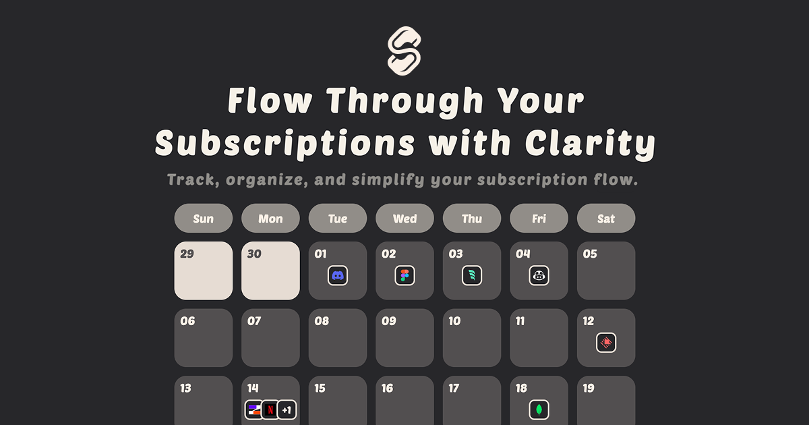

# Subflow

## 📖 Overview

**Subflow** is a free, intuitive subscription management tool that helps you take control of your recurring expenses. Whether it’s Netflix, Spotify, SaaS tools, or any other recurring expenses — Subflow brings them all together into one clean, organized dashboard.

## ✨ Key Features

### 📦 Centralized Subscription Management

- Track, edit, and categorize subscriptions in one place
- Built-in [SVGL](https://svgl.app/) icon library for fast service recognition
- Automatically convert yearly plans into monthly averages

### 📅 Calendar-Based Tracking

- Visualize upcoming charges on your calendar
- Clearly display payment cycles for each subscription
- Stay ahead of your billing schedule

### 📊 Visual Spending Analytics

- Analyze your subscription flow through interactive charts
- Understand spending ratios and monthly totals at a glance
- Support for multiple chart types and views

### 🌐 Multi-language & Multi-currency

- Fully localized in English and Traditional Chinese
- Track subscriptions in your preferred currency
- Automatic currency conversion with real-time exchange rates

### 🔄 Real-time Cloud Sync

- Data is always up-to-date across all devices
- Secure and consistent access from any login location
- Automatic cloud backup ensures peace of mind

## 🤝 Contributing

We welcome contributions! Please see our [Contributing Guide](CONTRIBUTING.md) for details.

## 📝 License

This project is licensed under the **GNU Affero General Public License v3.0 (AGPL-3.0)**.  
See the [LICENSE](LICENSE) file for details.
