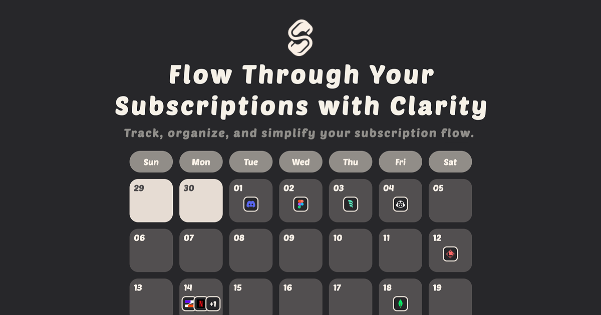

# Subflow

## 📖 Overview

**Subflow** is a free, intuitive subscription management tool that helps you take control of your recurring expenses. Whether it’s Netflix, Spotify, SaaS tools, or any other recurring expenses — Subflow brings them all together into one clean, organized dashboard.

If you enjoy this service, consider supporting us:

<!-- markdownlint-disable MD033 -->

<!-- markdownlint-enable MD033 -->

## ✨ Key Features

### 📦 Centralized Subscription Management

- Track, edit, and categorize subscriptions in one place
- Built-in [SVGL](https://svgl.app/) icon library for fast service recognition
- Automatically convert yearly plans into monthly averages

### 📅 Calendar-Based Tracking

- Visualize upcoming charges on your calendar
- Clearly display payment cycles for each subscription
- Stay ahead of your billing schedule

### 📊 Visual Spending Analytics

- Analyze your subscription flow through interactive charts
- Understand spending ratios and monthly totals at a glance
- Support for multiple chart types and views

### 🌐 Multi-language & Multi-currency

- Fully localized in English and Traditional Chinese
- Track subscriptions in your preferred currency
- Automatic currency conversion with real-time exchange rates

### 🔄 Real-time Cloud Sync

- Data is always up-to-date across all devices
- Secure and consistent access from any login location
- Automatic cloud backup ensures peace of mind

### 📧 Email Notifications

- Receive timely reminders before subscription renewals
- Stay informed about upcoming charges via email
- Never miss a payment or renewal date again

### 👥 Co-Subscriber Management

- Share subscriptions with family, friends, or teammates
- Track who's splitting costs on shared services
- Manage group subscriptions effortlessly

### 🚀 Raycast Extension

- Browse your subscriptions directly from Raycast
- Check upcoming renewals from the macOS menu bar
- Quick access without opening a browser — available on the [Raycast Extension Store](https://www.raycast.com/ridemountainpig/subflow)

### 🤖 Smart Add Subscription

- Quickly add subscriptions with intelligent auto-detection
- Paste in subscription details, email receipt, or description to automatically extract subscription details
- Streamlined input with smart suggestions and autofill

## 🤝 Contributing

We welcome contributions! Please see our [Contributing Guide](CONTRIBUTING.md) for details.

## 📝 License

This project is licensed under the **GNU Affero General Public License v3.0 (AGPL-3.0)**.  
See the [LICENSE](LICENSE) file for details.
