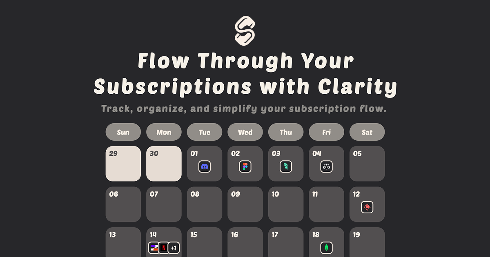

# Subflow x Zeabur AI Hub

## 📖 Overview

**Subflow** is a free, intuitive subscription management tool that helps you take control of your recurring expenses. With the power of **Zeabur AI Hub**, Subflow now offers intelligent features that make managing subscriptions easier than ever.

## 🤖 Smart Add Feature

The **Smart Add** feature leverages Zeabur AI Hub to automatically analyze and extract subscription information, eliminating the need for manual data entry.

### How It Works

1. **Input** - Users can provide subscription information in two modes:
    - **Upload Mode**: Drag & drop or click to upload files
        - Supported formats: JPG, PNG, PDF
    - **Text Mode**: Paste subscription details, email receipts, or descriptions directly

2. **AI Analysis** - Zeabur AI Hub processes the input and intelligently extracts:
    - 📦 **Service Name** - Identifies the subscription service and matches it to existing services in Subflow library (e.g., Netflix, Spotify)
    - 💰 **Price** - Extracts the subscription cost
    - 🔄 **Billing Cycle** - Determines if it's monthly, yearly, or custom
    - 📅 **Start Date** - Identifies when the subscription began
    - 💳 **Currency** - Detects the payment currency

3. **Smart Validation** - The AI automatically detects if the content is not a valid subscription receipt and notifies the user

4. **Review & Confirm** - Users can review and edit the extracted information, with option to re-analyze if needed

5. **One-Click Add** `[Feature Work]` - After analysis is complete, users can directly add the subscription to Subflow with a single click

### Benefits

- ⚡ **Save Time** - No more manual data entry
- ✅ **Accuracy** - AI-powered extraction reduces human error
- 🎯 **Convenience** - Add subscriptions from emails or screenshots instantly

## 🔧 Zeabur AI Hub Integration

Subflow uses **Zeabur AI Hub** as its AI backend, providing:

- **Gemini Model** - Uses Google's Gemini model through Zeabur AI Hub to analyze subscription data
- **Multi-Modal Analysis** - Supports analyzing images, files, and text input for subscription extraction
- **Intelligent Parsing** - Accurately extracts subscription details from various formats and languages

### Deployment

1. Deploy Subflow easily with Zeabur using GitHub Deploy.
2. Zeabur automatically detects the project and generates a Dockerfile
3. Deploy with zero configuration - Zeabur handles the build and deployment automatically
